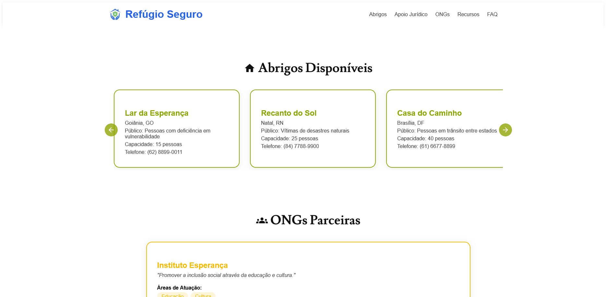
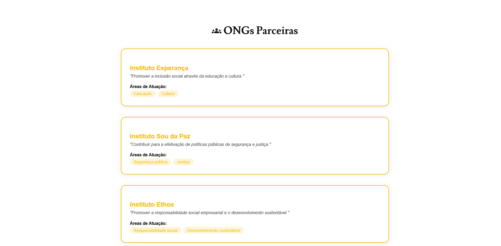
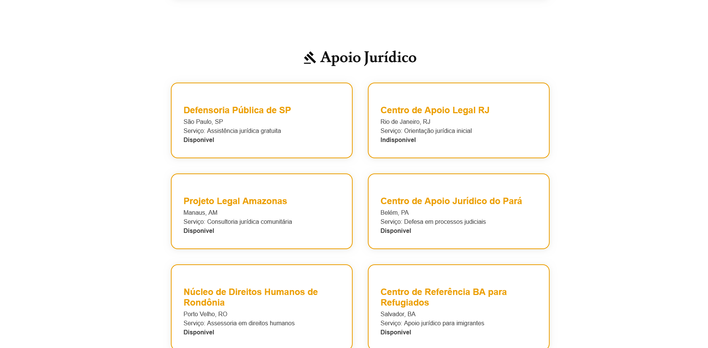
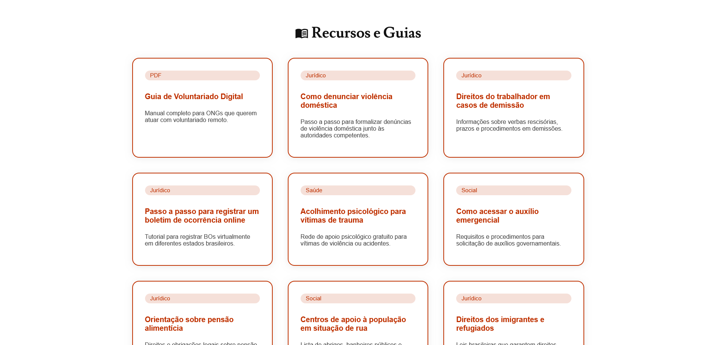
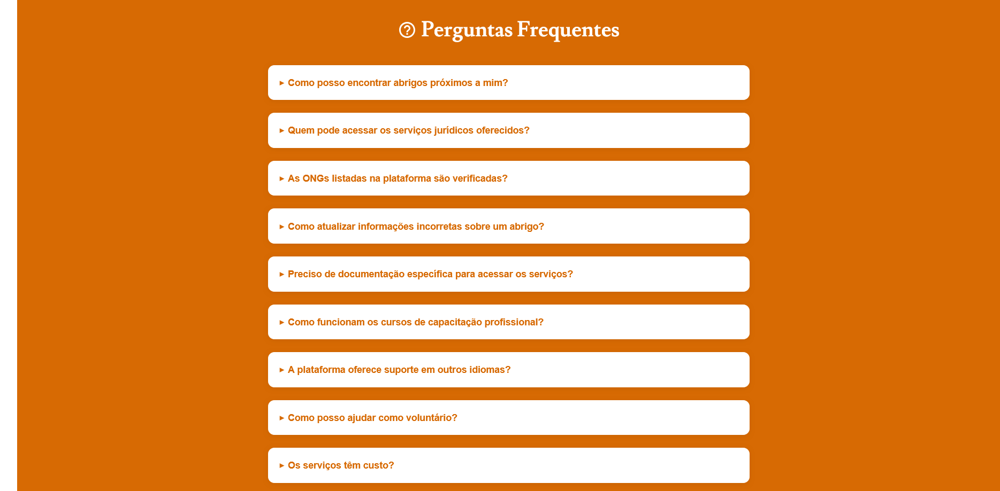

# Refúgio Seguro Frontend

## Contextualização
O Refúgio Seguro é uma plataforma que conecta pessoas em situação de vulnerabilidade a abrigos, ONGs, apoio jurídico e recursos confiáveis. O objetivo é facilitar o acesso a direitos básicos e informações seguras, promovendo acolhimento e proteção para mulheres, pessoas LGBTQIAPN+, refugiados, imigrantes, crianças, idosos e outros grupos marginalizados.

## Tecnologias Utilizadas
- **Next.js**: 13+
- **TypeScript**: 4.9+
- **CSS puro**
- **Framer Motion**: animações em React
- **React Icons**: ícones modernos
- **API Refúgio Seguro**: [https://github.com/FK1FF3R/refugio-seguro](https://github.com/FK1FF3R/refugio-seguro)

## Imagens do Projeto







## Passo a Passo para Execução Local

1. **Clone o repositório da API**
   ```bash
   git clone https://github.com/FK1FF3R/refugio-seguro.git
   cd refugio-seguro
   npm install
   npm run dev
   # A API estará disponível em http://localhost:3001
   ```
2. **Clone este repositório (frontend)**
   ```bash
   git clone https://github.com/FK1FF3R/Refugio-Seguro-Frontend.git
   cd refugio-seguro-frontend
   npm install
   ```
3. **Configure o arquivo `.env.local`**
   Crie um arquivo `.env.local` na raiz do frontend com o conteúdo:
   ```env
   NEXT_PUBLIC_API_URL=http://localhost:3001
   ```
4. **Rode o frontend**
   ```bash
   npm run dev
   # O frontend estará disponível em http://localhost:3000
   ```

## Organização de Pastas

```
src/
  app/
    components/
      layout/         # Componentes de layout global (Header, Footer)
      sections/       # Sections principais da página (Abrigos, ONGs, etc)
      ClientSections.tsx # Componente client para animações e controle das sections
    hooks/            # Hooks customizados (ex: useFadeInOnScroll)
    styles/           # CSS modularizado por componente/section
    globals.css       # Estilos globais e variáveis CSS
    layout.tsx        # Layout principal do Next.js
    page.tsx          # Página principal
  services/           # Serviços de API
  types/              # Tipos TypeScript compartilhados
public/
  # Imagens, favicon, SVGs, logo.png
```

## Padrões e Boas Práticas
- Componentização, tipagem forte, imports absolutos, CSS modularizado, hooks customizados, Clean Code.
- Animações feitas com Framer Motion.
- Ícones com React Icons.

## Sobre (About)
- **Site:** (adicione aqui o link caso esteja hospedado)
- **API:** [https://github.com/FK1FF3R/refugio-seguro](https://github.com/FK1FF3R/refugio-seguro)
- **Apresentação LinkedIn:** (adicione aqui o link da postagem de apresentação)
- **Tópicos:** nextjs, typescript, acessibilidade


